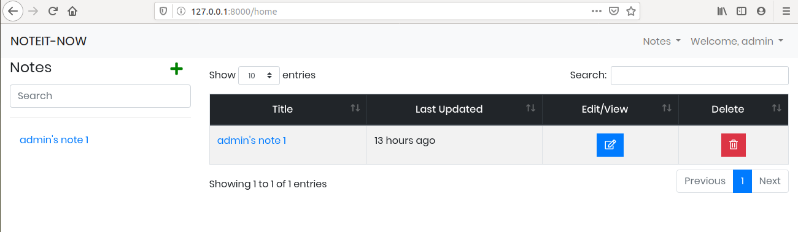

# NOTEIT-NOW

[](https://opensource.org/licenses/MIT)

A User-Freindly Note Taking Application with some stunning features. This project is a part of [Google Summer of Code](https://summerofcode.withgoogle.com/) - 2020 Coding Task from the organization: [Global Alliance for Genomic Health](https://www.ga4gh.org/).

## Table of content ##

- [Features](#features)
- [Installation & Setup](#installation)
- [Reporting Bugs](#reporting-bugs)
- [Contribution](#contributing)
- [Demonstration Snaps](#demonstration-snaps)
- [Get in touch](#-get-in-touch)


### Made by [Syed Farhan Ahmad](https://www.linkedin.com/in/syedfarhanahmad/)

## Features ##

[(Back to top)](#table-of-content)

- Create new Note(s)
- Update existing Note(s)
- Delete existing Note(s)
- Dedicated View for each note
- Multiple tags support for each note
- Search for a note
- Login/Sign Up pages 
- DB schema that supports multiple users
- Powerful admin console(Django-admin)
- Simple and elegant UI


# Installation #

[(Back to top)](#table-of-content)

- Clone the repository

```bash
git clone https://github.com/born-2learn/noteitnow.git
```

It is recommended to follow further steps while in a virtual environment. To create a virtual environment, follow [this link](https://packaging.python.org/guides/installing-using-pip-and-virtual-environments/).

- Next, Install Dependencies

```bash
cd NoteIt-Now
pip3 install -r requirements.txt
```

- Run django migrations

```bash
python3 manage.py makemigrations
python3 manage.py migrate
```

- Run django migrations( for apps without migrations)

```bash
python3 manage.py migrate --run-syncdb
```

- Run django server

```bash
python3 manage.py runserver
```


## Reporting Bugs ##
[(Back to top)](#table-of-content)

Please, use [ISSUE_TEMPLATE/bug_report.md](.github/ISSUE_TEMPLATE/bug_report.md) to create an issue and describe your bug.


## Contributing ##
[(Back to top)](#table-of-content)

Below is a list of suggested contributions you can make. Before you work on any, it is advised that you create an issue using the [ISSUE_TEMPLATE/contribution.md](.github/ISSUE_TEMPLATE/contribution.md) to tell us what you plan to work on. This ensures that your work can be merged to the `master` branch in a timely manner.


# Demonstration Snaps #

[(Back to top)](#table-of-content)

### HomePage with basic information, and developer's accounts links.

   

### Login Page with NavBar


### Sign Up page


### Notes - The HEART of the application



## Get in Touch ##

[(Back to top)](#table-of-content)

[LinkedIn](https://www.linkedin.com/in/syedfarhanahmad/)

[Follow me on Github](https://github.com/born-2learn)

## License
[](https://opensource.org/licenses/MIT)   
This project is based on the **MIT Licence**.


